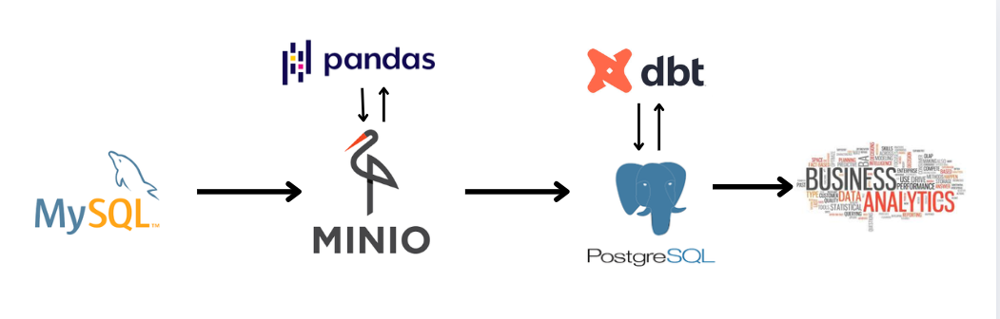
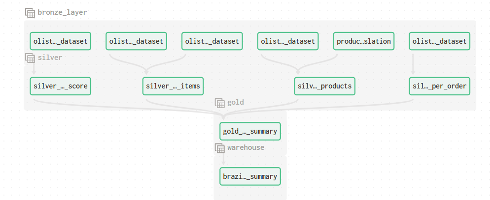
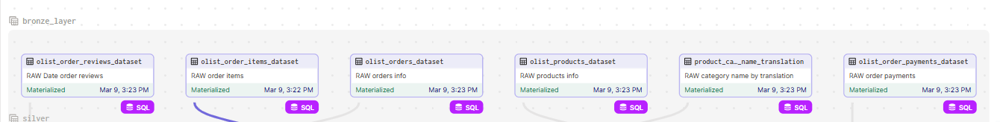
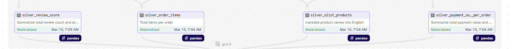
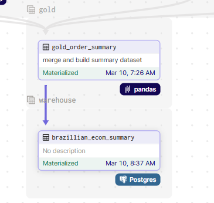

# ETL Pipeline for Brazilian E-Commerce Data

This project implements a comprehensive **ETL (Extract, Transform, Load)** pipeline using **Dagster**, **MinIO**, and **DBT** to process the **Brazilian e-commerce dataset**. The entire pipeline is designed to extract raw data, transform it through several processing stages, and load it into a structured dataset for Business Analytics (BA) purposes.

---

## Project Overview

The flow involves moving raw data through three layers:

- **Bronze Layer**: Raw data from MySQL in CSV format is uploaded to MinIO.
- **Silver Layer**: Data is processed and enriched using **Data Analytics (DA)** methods, with tables being joined, cleaned, and analyzed.
- **Gold Layer**: Final dataset is created by joining multiple Silver-layer tables into a comprehensive dataset.
- **Warehouse Layer**: The final dataset is loaded into a **PostgreSQL** database for querying and reporting.

---

## Directory Structure

Below is an overview of the directory structure, explaining each file and its purpose in the ETL process:

```/dagster_home
/Dataset
/Dockerimages
/etl_pipeline
├── /dbt_ecommerce
├── /etl_pipeline
│   ├── /assets
│   │   ├── bronze_layer.py
│   │   ├── silver_layer.py
│   │   └── warehouse_layer.py
│   ├── /resources
│   │   ├── minio_io_manager.py
│   │   ├── mysql_io_manager.py
│   │   └── psql_io_manager.py
│   ├── __init__.py
├── Dockerfile
├── requirements.txt
/docker-compose.yaml
/env
/Makefile
/load_data
/README.md


```
### Explanation of the Structure

- **`/dagster_home`**: Home directory for Dagster, likely containing configuration and workspace-related files.
  
- **`/Dataset`**: Stores raw and processed dataset files.
  
- **`/Dockerimages`**: Contains Docker images used in the project.
  
- **`/etl_pipeline`**: Root directory for ETL logic.
  - **`/dbt_ecommerce`**: Stores DBT transformations for e-commerce data.
  - **`/etl_pipeline`**: Main ETL processing folder.
    - **`/assets`**: Contains Python scripts for processing different layers:
      - `bronze_layer.py`: Handles raw data ingestion.
      - `silver_layer.py`: Processes and transforms data.
      - `warehouse_layer.py`: Final step before storing in PostgreSQL.
    - **`/resources`**: Stores I/O managers for different storage systems:
      - `minio_io_manager.py`: Manages MinIO interactions.
      - `mysql_io_manager.py`: Manages MySQL interactions.
      - `psql_io_manager.py`: Manages PostgreSQL interactions.
    - `__init__.py`: Initializes the Python package.

- **Other Files**:
  - `Dockerfile`: Defines the ETL environment setup.
  - `requirements.txt`: Lists dependencies for the project.
  - `docker-compose.yaml`: Configuration for containerized deployment.
  - `/env`: Environment variables file.
  - `/Makefile`: Contains commands for automation.
  - `/load_data`: Folder for scripts or files related to loading datasets.
  - `README.md`: Documentation for the project.

---

## ETL Pipeline Process


1. **Bronze Layer: Raw data is upload from MySQL (MySQL to MinIO)**

   - The raw data is initially stored in **MySQL** in CSV format. This raw data includes six key tables:
     - `olist_order_items_dataset`
     - `olist_order_payments_dataset`
     - `olist_order_reviews_dataset`
     - `olist_orders_dataset`
     - `olist_products_dataset`
     - `product_category_name_translation`


   

2. **Silver Layer: Data Processing and Transformation**

   - In this layer, data is grouped and transformed using **Data Analytics** processes. This involves joining, cleaning, and enriching various tables. For example:
     - Joining `olist_products_dataset` with `product_category_name_translation` to add English names for products.
     - Aggregating payment data by `order_id` to get the total payment value and count of payment types for each order.
     - Aggregating review data to calculate the average review score for each order.

   

3. **Gold Layer: Final Dataset Creation**

   - The Silver-layer tables are joined together to create a final, clean dataset. Specifically:
     - Joining `olist_order_items_dataset` with `olist_products_dataset` to get product-related information.
     - Joining with the payment summary (`olist_order_payments_dataset`) and review scores (`olist_order_reviews_dataset`).

   - Any missing review scores for `order_id` are marked as `NA`.

   

4. **Warehouse Layer: Data Loading to PostgreSQL**

   - The final dataset, from the Gold layer, is loaded into a **PostgreSQL** database for querying and reporting.


---

## Final Dataset

The final dataset contains key information about orders, including product details, reviews, timestamps, payment information, and delivery dates. This dataset serves as a foundation for further Business Analytics (BA) projects.

---

## Next Steps

The next phase of this project will involve using **DBT (Data Build Tool)** for further data transformations and analytics within PostgreSQL. This will help automate the process and ensure consistency in the data pipeline.

In addition, we plan to scale this pipeline to handle large datasets and implement scheduled jobs using **CronJobs** for regular data loading and transformation tasks. 

Cloud platforms like **AWS** will also be considered for scalability and cloud storage solutions.

---

## Technical Details of Key Layers

### Silver Layer Transformations

1. **Asset: `dim_olist_products`**
   - Joins `olist_products_dataset` with `product_category_name_translation` to get the English names of products.
   - Output: `olist_product_dataset` with an additional column `product_name_english`.

2. **Order Payments:**
   - Solution: Aggregate the payment values and count the number of payment types for each `order_id`.
   - Output: A table summarizing total payment and count of payment types for each order.

3. **Order Reviews:**
   - Solution: Calculate the total number of reviews and average review score for each `order_id`.
   - Output: A table (`review_score`) with columns `order_id`, `score_review_avg`, and `total_review`.

4. **Order Items:**
   - Solution: Count the number of items for each order (`order_id`), and join this information with `olist_orders_dataset` to get the full order details.
   - Output: A table that also converts `varchar` timestamps into proper `timestamp` format.

### Gold Layer

1. **Join Operations:**
   - The Gold layer joins four key Silver-layer tables: `silver_order_items`, `silver_olist_products`, `silver_payment_summary_per_order`, and `silver_review_score`.

2. **Missing Review Scores:**
   - Any missing review scores in the final `gold_summary_order` dataset will be filled with `NA` values.

---

## Conclusion

This ETL pipeline leverages powerful tools like **Dagster**, **MinIO**, **DBT**, and **PostgreSQL** to create a scalable, efficient data processing framework for the Brazilian e-commerce dataset. The resulting dataset will support a variety of business analytics applications, enabling better decision-making based on comprehensive order, payment, and review data.

---